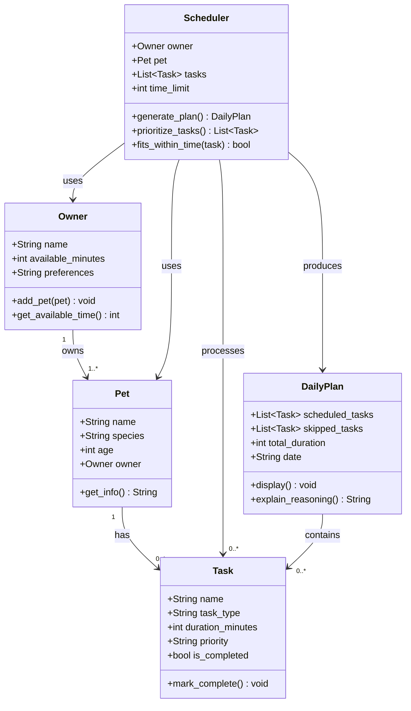

# PawPal+ UML Class Diagram

```mermaid
classDiagram
    class Owner {
        +String name
        +int available_minutes
        +String preferences
        +add_pet(pet) void
        +get_available_time() int
    }

    class Pet {
        +String name
        +String species
        +int age
        +Owner owner
        +get_info() String
    }

    class Task {
        +String name
        +String task_type
        +int duration_minutes
        +String priority
        +bool is_completed
        +mark_complete() void
    }

    class Scheduler {
        +Owner owner
        +Pet pet
        +List~Task~ tasks
        +int time_limit
        +generate_plan() DailyPlan
        +prioritize_tasks() List~Task~
        +fits_within_time(task) bool
    }

    class DailyPlan {
        +List~Task~ scheduled_tasks
        +List~Task~ skipped_tasks
        +int total_duration
        +String date
        +display() void
        +explain_reasoning() String
    }

    Owner "1" --> "1..*" Pet : owns
    Pet "1" --> "0..*" Task : has
    Scheduler --> Owner : uses
    Scheduler --> Pet : uses
    Scheduler --> "0..*" Task : processes
    Scheduler --> DailyPlan : produces
    DailyPlan --> "0..*" Task : contains
```
