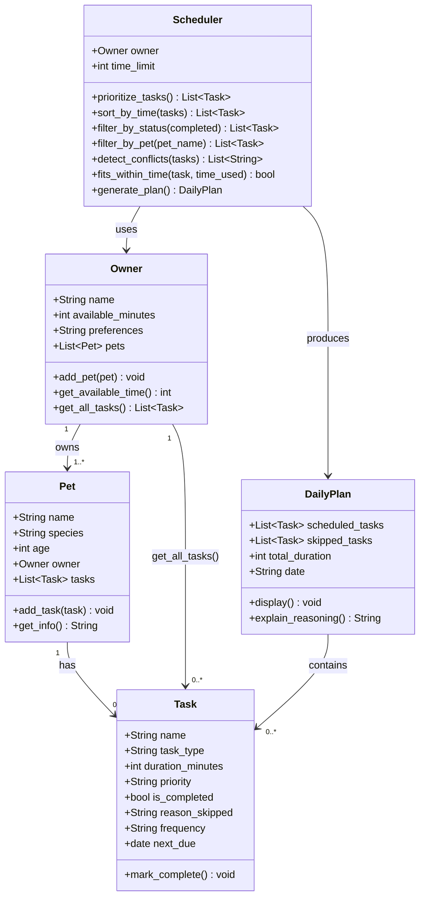

# PawPal+ Final UML Class Diagram

## Changes from initial UML (Phase 1)

| What changed | Why |
|---|---|
| `Task` gained `frequency` and `next_due` | Added in Phase 4 to support recurring tasks |
| `Scheduler` gained `sort_by_time()`, `filter_by_status()`, `filter_by_pet()`, `detect_conflicts()` | Added algorithmic layer in Phase 4 |
| `Owner` gained `get_all_tasks()` | Added so Scheduler stays decoupled from Pet internals |
| `prioritize_tasks()` uses dual sort key (priority + duration) | Tiebreaker added for same-priority tasks |
| Removed single-`pet` constructor on Scheduler | Scheduler now works with all pets via Owner |
